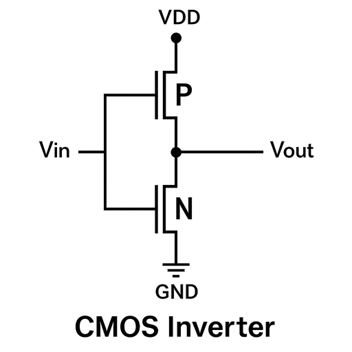
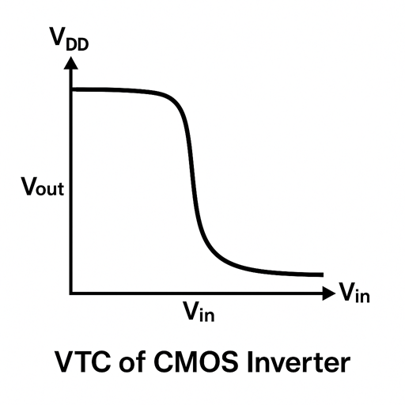

### CMOS Inverter Basics

A CMOS (Complementary Metal-Oxide-Semiconductor) inverter is the fundamental building block of digital integrated circuits. It performs the logical NOT operation, where the output is the complement of the input. 

The CMOS inverter consists of two transistors:
1. **PMOS (P-channel MOSFET)**: Connected between VDD (supply voltage) and the output
2. **NMOS (N-channel MOSFET)**: Connected between the output and GND (ground)

### Operation of CMOS Inverter

The operation of a CMOS inverter can be summarized as follows:

1. **When input is LOW (0V or GND)**:
   - PMOS transistor is ON (conducting)
   - NMOS transistor is OFF (non-conducting)
   - Output is connected to VDD through the PMOS → Output is HIGH

2. **When input is HIGH (VDD)**:
   - PMOS transistor is OFF (non-conducting)
   - NMOS transistor is ON (conducting)
   - Output is connected to GND through the NMOS → Output is LOW

This complementary behavior ensures that the output is always the logical inverse of the input.

### Voltage Transfer Characteristic (VTC)

The Voltage Transfer Characteristic (VTC) of a CMOS inverter plots the output voltage as a function of the input voltage. An ideal inverter would have a perfectly rectangular VTC, but a real CMOS inverter has a transition region.

The VTC can be divided into five regions:
1. **Region I**: Input ≈ 0V, Output ≈ VDD (PMOS on, NMOS off)
2. **Region II**: PMOS in saturation, NMOS in cutoff
3. **Region III**: PMOS in saturation, NMOS in saturation (transition region)
4. **Region IV**: PMOS in cutoff, NMOS in saturation
5. **Region V**: Input ≈ VDD, Output ≈ 0V (PMOS off, NMOS on)

)

### Important Parameters for CMOS Inverter

1. **Switching Threshold (VM)**: The input voltage at which the output transitions; ideally, VM = VDD/2
2. **Noise Margin**: The amount of noise a gate can tolerate
   - **NML (Noise Margin Low)**: VOL - VIL
   - **NMH (Noise Margin High)**: VOH - VIH
3. **Propagation Delay**: Time taken for the output to change in response to an input change
   - **tPLH**: Low-to-High propagation delay
   - **tPHL**: High-to-Low propagation delay

### SPICE Simulation

SPICE (Simulation Program with Integrated Circuit Emphasis) is an industry-standard tool for simulating and analyzing electronic circuits. For a CMOS inverter, we can use SPICE to:

1. Generate the Voltage Transfer Characteristic (VTC)
2. Calculate propagation delays
3. Analyze power consumption
4. Study the effect of transistor sizing on performance

A basic SPICE netlist for a CMOS inverter includes:
- MOSFET models for NMOS and PMOS
- Power supply definition
- Input voltage source
- Node connections
- Analysis commands (DC sweep, transient analysis, etc.)

In this experiment, we will create a SPICE netlist for a CMOS inverter and observe its behavior through simulation.